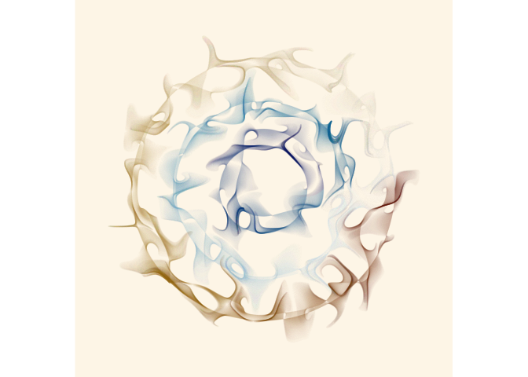

# Introduction to statistical software - R {#soft}

### R packages required for this chapter

```{r message=FALSE}
library(knitr)
library(tidyverse)
library(broom)
library(psych)
library(magrittr)

```

A [twitter post](https://twitter.com/MaartenvSmeden/status/995791001825431552) has nicely summarized 10 reasons "Why should I bother learning to code";  

1. Encourages reproducible statistical analyses    
2. Enables easy incorporation of “New” and "personalized" statistical methods    
3. Code sharing - be inspired and inspiring    
4. Career perspectives increased with this skill    
5. Data visualization -> better understanding of your data      
6. Avoid copy / paste frustrations      
7. Customization - get exactly what you want    
8. Develop interactive graphs and web-apps to increase dissemination and understanding of your work   
9. Consults with a statistician easier        
10. Personal satisfaction (it can be fun)    

In summary, coding has the attributes of flexibility, transparency, and reproduciblity which should enhance overall research quality.
 
## Statistical software - R

The most important element in clinical epidemiology is NOT which statistical software is chosen but rather an in depth understanding the basic epidemiologic and statistical concepts. Having said that, there are many advantages for `R`, largely summarized by the fact that [R](https://www.nytimes.com/2009/01/07/technology/business-computing/07program.html?pagewanted=all) is the lingua franca of data science, used by millions of data experts. 


**Why `R`? **     

* Free and open source software environment for statistical computing and graphics     
* Open source indicates the original source code is freely available, may be redistributed, and modified     
* Allows & encourages researchers to modify, extend, and develop additions to the base program     
* Additions are referred to as packages    
* Use of scripts and Rmarkdown encourages reproducible research    
* Active online community facilitates formal courses, sharing of solutions to coding queries   
* [Rstudio](https://rstudio.com), an integrated development environment (IDE) greatly facilitates the `R` experience    
* Combining with `Rmarkdown` can easily create, reproduce and share your work via html or pdf files      

This book is not intended to be first line resource for learning `R`, as there are many excellent online learning resources. It should be noted that there are at least 2 flavors or `R` - 1) standard base `R` 2) [tidyverse version](https://www.tidyverse.org), a collection of R packages designed with a common  philosophy, grammar, and data structures especially useful for data science. 

**Learning and help resources **     

* `R` definitive online resource can be found at [CRAN](https://cran.r-project.org/doc/manuals/R-intro.html) has a number of manuals online    
* Condensed `R` reference card can be found [here][https://cran.r-project.org/doc/contrib/Short-refcard.pdf]  
* The [swirl](http://swirlstats.com/) tutorial teaches R programming and data science interactively, install `swirl` with `install.packages("swirl")` and run  with the `swirl()` command   
* Helpful cheet sheets can be found as the [RStudio website](https://rstudio.com/resources/cheatsheets/)    
* [UCLA](http://statistics.ats.ucla.edu/stat/r/)
* [Quick R](http://www.statmethods.net)
* [R blogger](http://www.r-bloggers.com), a daily compilation of R blogs from over the interent
* [Advanced R](http://adv-r.had.co.nz)
* After acquiring the basics, many questions are answered with the help of [Stackoverflow](https://stackoverflow.com/questions/tagged/r)    
* Good old [Google](https://www.google.com/search?sxsrf=ALeKk01Tqej0EWIEpcnxnJzIMqQG5GTjXg%3A1610916306178&ei=0qEEYMWiCqqyggfTz6vYAw&q=r+questions+and+answers&oq=r+questions&gs_lcp=CgZwc3ktYWIQARgBMgUIABDJAzICCAAyAggAMgIIADICCAAyAggAMgYIABAWEB4yBggAEBYQHjIGCAAQFhAeMgYIABAWEB46BAgjECc6CggAELEDEIMBEEM6BAgAEEM6BwgAELEDEEM6BwgjEOoCECc6CwguELEDEMcBEKMCOggIABCxAxCDAToICC4QsQMQgwE6BQguELEDOg0IABCxAxCDARDJAxBDOgoILhCxAxCDARBDOggIABDJAxCRAjoHCAAQFBCHAjoICC4QxwEQrwFQkj1YnmRgnIoBaAFwAHgAgAFuiAHIB5IBBDExLjGYAQCgAQGqAQdnd3Mtd2l6sAEKwAEB&sclient=psy-ab) using "r type your question"     

Within the `R` environment to find help for a specific function, for example `epi.2by2` in the `EpiR` package try typing     
* `help("epi.2by2")`      
* `example("epi.2by2")`     
* `help.search("epi.2by2")`   
* RSiteSearch("epi.2by2") - provides online search    

**Packages **    

The capabilities of base `R` are greatly extended using “packages”. These are distributed over the Internet via [CRAN](https://cran.r-project.org/) and can be downloaded either directly during an `R` session by typing the command `install.packages("pakage.name")`. Alternatively this can be done via RStudio which also provides a directory of all downloaded and installed packages. In 2010, there were about 2,000 packages, by 2016 there were almost 10,000 and by 2020 this has reached almost 17,000. This rapid growth of these important resources is one of the prime reasons for the ever increasing popularity of `R`. Of course, there is also a chick and egg argument that sees the increasing popularity of R as a reason why more people are contributing packages.  
For epidemiologists some of the standard epidemiology packages include `epiR`, `epibasix`, `epitools`, and `Epi` but there are over 30 packages including some that are ultra specialized. 

```{r, echo=FALSE, out.heigth="75%", fig.cap="Epi packages available on CRAN", fig.align="center"}

```

## R - Common data and variable manipulations

`R` is a programming language based on the concept of objects, which may be data or code, in the form of procedures. The data structures are a form of organizing and storing data are four basic types - vector (single dimension structure of 1 type), matrix (two dimension structure of 1 type), list (single dimensional data structure of different types), & data frame (special case of a list where each component is of same length). Data frames are the most common data structure used in epidemiology analyses.    
Here are some common data manipulations in R that represent the minimal knowledge or comfortable level that the reader may like to have to easily follow the code in later chapters.

**Creating a data frame**
```{r}
# creation of a simple data frame (dat)
dat <-  data.frame('id'=1:4, 'Age'=c(21,15,14,18), 'Gender'=c('M','F','F','M'))
dat
```

**Read a data file**
```{r message=FALSE, warning=FALSE}
dat1 <- read.csv("data/pima_db.csv")
head(dat1,3)
```
Other file formats including Excel, SAS, Stata, SPSS files can be read with `readxl::read_excel()`, `sas7bdat::read.sas7bdat()`, `Hmisc::spss.get()`, `foreign::read.dta()` respectively.   

**Variable manipulation**

```{r message=FALSE, warning=FALSE}
# create a new variable based on cutoff on existing variable
# Base R
dat1$Glucose_hi <- NA
dat1[dat1$Glucose >120, 'Glucose_hi'] <- 1
dat1[dat1$Glucose <=120, 'Glucose_hi'] <- 0
head(dat1[,c(1:3,8:10)],4)

#tidyverse
library(tidyverse)
dat2 <- dat1 %>% mutate(Age_old = ifelse(Age > 50, 1, 0))  
head(dat2[,c(1:3,8:11)],10)

```

**Variable and data subsetting**

```{r message=FALSE, warning=FALSE}
#################
# Variable subsetting
#################
# Base R
dat1s = subset(dat1, select = c('Pregnancies', 'Glucose'))
head(dat1s)

# tidyverse
dat1 %>% dplyr::select(Pregnancies, Glucose) %>% head()

#################
# Data subsetting
#################
# Base R #1
dat1s <-  subset(dat1, subset = Pregnancies >2 & Glucose_hi == 1) # notice need for == when looking for equality
head(dat1s[,c(1:4,8:10)])
# Base R #2
dat1ss = dat1[which(dat1$Pregnancies >2 & dat1$Glucose_hi ==1),]
head(dat1ss[,c(1:4,8:10)])

# tidyverse
library(tidyverse)
dat1 %>% dplyr::filter(Pregnancies >2 & Glucose_hi == 1) %>% head(,c(1:4,8:10))

```

**Basic Data Descriptions**

```{r message=FALSE, warning=FALSE}
# Base R
summary(dat1)
# Other approaches
psych::describe(dat1)
broom::tidy(dat1)
```

## RStudio - **The** IDE for R

[RStudio](https://rstudio.com) is an integrated development environment (IDE) for R. For overall convenience, flexibility, educational resources, and ongoing development it is in my opinion an unparalleled environment for working in R. It offers a multi-pane console, syntax-highlighting editor that supports direct code execution, as well as tools for plotting, history, project and workspace management. There are many tools within RStudio that facilitate coding including numerous shortcuts which accessed from a drop down menu within RStudio and can be found [here]( https://support.rstudio.com/hc/en-us/articles/200711853-Keyboard-Shortcuts). Several shortcuts that I find most helpful are listed below.

```markdown
Table: Very useful RStudio shortcuts
| Command                          	| Windows                                     	| Mac             	|
|----------------------------------	|---------------------------------------------	|-----------------	|
| Assignment operator              	| Alt + -                                     	| Opt + -         	|
| Commenting & Uncommenting Code   	| Ctrl + Shift + C                            	| Cmd + Shift + C 	|
| Add the Pipe %>%                 	| Ctrl + Shift + M                            	| Cmd + Shift + M 	|
| Keyboard Shortcut Cheat Sheet    	| Alt + Shift + K                             	| Opt + Shift + K 	|
| Move cursor beginning of line    	| Home                                        	| Cmd+Left        	|
| Move cursor to end of line       	| End                                         	| Cmd+Right       	|
```

When using RStudio, it generally most helpful to begin by creating a `New Project from the `File` drop down menu. As you will soon appreciate this has definitely file management advantages. For individual files, I find it most useful to create individual RMarkdown documents. For this book, each chapter is a separate `Rmd` file. These files have the advantage of being able to combine free text and `R` code chunks which via a synthesis of the `markdown` language and `Pandoc` allows the output to be on the format of your choice (html, LaTex/pdf, WORD).

## R - More than a statistical program 

`R` is  much more than a mere statistical program. It is a complete programming language which while highly advantageous does result in a non trivial learning curve. One of the most outstanding attributes of `R` is the ability to produce publication quality data visualizations with either base `R` or within the tidyverse universe by using `ggplot2` (see next chapter). Interactive graphics can also be easily produced. To appreciate the range of graphical activities possible, here is a self portrait drawn by `R`. The code for this may be found [here](https://github.com/brophyj/book_v1/blob/main/portrait.R). 


```{r, echo=FALSE, out.width="33%", fig.cap="Self portrait", fig.align="center"}
knitr::include_graphics("img/brophy.png")

```

Some beautiful art and the accompanying `R` code can be found [here](https://jasmines.djnavarro.net)

```{r, echo=FALSE, out.width="50%", fig.cap="R art", fig.align="center"}


```

## R - General Public License
```{block type='FOO'}
R is free software and comes with ABSOLUTELY NO WARRANTY.
You are welcome to redistribute it under the terms of the
GNU General Public License versions 2 or 3.
For more information about these matters see
http://www.gnu.org/licenses/.
```

