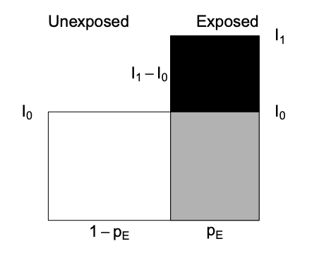
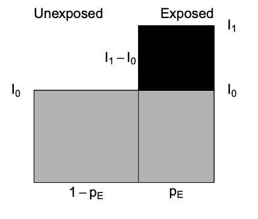

# Contingency tables, measures of association & R packages {#meas}

### R packages required for this chapter

```{r message=FALSE}
library(knitr)
library(kableExtra)
library(tidyverse) # specifically dplyr and ggplot2
library(epiR)
library(epibasix)
library(epitools)
```

## Proportions - One sample $\chi^2$ tests {#meas1}

Suppose we have the following data and want to test if the hypothesis that $\pi$ = 0.80 is true. In this simple example, the base `R` `chisq.test` function is more than adequate.

|            | Success | Failure |
|------------|---------|---------|
| Population | 60      | 40      |    

```{r}
# one sample chi sq test
x <- c(60,40)
chisq.test(x, p = c(.8, .2))
```

For small sample sizes (n < 5), `chisq.test` is not valid. A famous example of a small data set is Fisher's [lady tasting tea example](https://en.wikipedia.org/wiki/Lady_tasting_tea). In this experiment, a lady claims she can tell if milk is added to the cup before or after the tea. suppose there are 8 cups, 4 with milk added first and 4 with milk added after the tea. How unlikely would it be if she could identify correctly the 8 cups? This can be calculated by hand using the [hypergeometric distribution](https://en.wikipedia.org/wiki/Hypergeometric_distribution) or using `fisher.test`.

```{r}
Tea <- matrix(c(4, 0, 0, 4), nrow = 2,
      dimnames = list(Guess = c("Milk", "Tea"), Truth = c("Milk", "Tea")))
temp <- fisher.test(Tea, alternative = "greater")
Tea
temp
# more precise p value
temp$p.value
```
There is a 1.4% chance of this occurring.    


More commonly we will have larger 2X2 datasets, or more generally nXm datasets to investigate and these may be helpfully presented in contingency tables.

## Contingency tables 

Begin by reading in the `heart.csv` [dataset](https://github.com/brophyj/book_v1/blob/main/data/heart.csv) where the outcome status is the `fstat` variable. Details about the other variables can be obtained with `str()`. It is often of interest to initially explore any categorical exposure and outcome create a contingency table of `fstat` (alive / dead)  versus `gender` (men=0, women=1).

```{r}
heart <- read.csv("data/heart.csv", header = TRUE)
# create gender factor variable
heart$gender <- factor(heart$gender, labels = c("men", "women"))
# Create a 2-way contingency table of gender vs outcome
table(heart$gender,heart$fstat )
```

As discussed in Chapter \@ref(vis), graphical displays are often helpful and informative.
```{r}
# Create side-by-side barchart outcome and gender
ggplot(heart, aes(x = gender, fill = fstat)) + 
  geom_bar(position = "dodge")  +  #position = "dodge", to have a side-by-side (i.e. not stacked) barchart
  theme_bw()
```
     
There are more males than females in this dataset. Total male and female deaths are about equal but better survival rates in males. Marginals can be easily obtained as can statistical testing with `chisq.test` or `fisher.test`   
```{r}
tab <- table(heart$gender,heart$fstat )
# marginals
rowSums(tab)
colSums(tab)
paste("Probabilities conditional on columns")
prop.table(tab, 2)  
paste("\nProbabilities conditional on rows")
prop.table(tab, 1) 

# statistical testing
chisq.test(tab)
fisher.test(tab)

```
Now while the base `R` `chisq.test` function provides the OR, 95% CI, and a p value, we will show in section \@ref(packages) that the use of epidemiologic specific `R` packages allows the use of more customized and detailed functions.    
Suppose we are now interested in the gender outcomes association but according to the presence or absence of pre-existing cardiac disease. Adding this third variable, ` cvd` is straightforward but the limits of this approach are  readily appreciated as the number of variables increases.      

```{r}
table(heart$gender, heart$fstat, heart$cvd)
# Plot of alignment broken down by gender
ggplot(heart, aes(x = gender,fill = fstat )) + 
  geom_bar() +
  facet_wrap(~ cvd) +
  theme_bw()

```

## Some basic defintions

1.  **Cumulative incidence** ---proportion of new cases developing in an initial disease free population during a given risk period.

2.  **Incidence time** ---time span from 0 to the time of outcome/event/failure/occurrence

3.  **Person-time** ---length of time that each individual was in the population at risk of the event

4.  **Total person-time at risk** - sum of all individual person-times

5.  **Incidence rate** ---number of new cases of disease divided by person-time over the period

6.  **Incidence proportion or cumulative incidence** ---with complete cohort follow-up, it is the proportion of people who become cases among those in the population at the start of the interval. Can also be considered a measure of average risk

**Comparison of cumulative incidence and incidence rate**

+-------------+----------------------+----------------------+-------------------+--------------------+
|             | Cumulative Incidence | Cumulative Incidence | Incidence rate    | Incidence rate     |
+=============+======================+======================+===================+====================+
|             | FU complete          | FU incomplete        | FU complete       | FU incomplete      |
+-------------+----------------------+----------------------+-------------------+--------------------+
| Numerator   | cases                | Kaplan Meier         | Number cases      | Number cases       |
|             |                      |                      |                   |                    |
|             |                      | Lfe Table            |                   |                    |
+-------------+----------------------+----------------------+-------------------+--------------------+
| Denominator | population           | Kaplan Meier         | Person - time     | Average population |
|             |                      |                      |                   |                    |
|             |                      | Lfe Table            |                   |                    |
+-------------+----------------------+----------------------+-------------------+--------------------+
| Units       | no units             | no units             | Time^-1^          | Time^-1^           |
+-------------+----------------------+----------------------+-------------------+--------------------+
| Range       | 0 to 1               | 0 to 1               | 0 to infinity     | 0 to infinity      |
+-------------+----------------------+----------------------+-------------------+--------------------+
| Synonyms    | Probability          | Probability          | Incidence density | Incidence density  |
|             |                      |                      |                   |                    |
|             | Proportion           | Proportion           |                   |                    |
+-------------+----------------------+----------------------+-------------------+--------------------+

Risk is a general term but often refers to cumulative incidence (Q) but other interpretations including instantaneous risk (hazard) and risk at a given time point (prevalence).\
Incidence rate and cumulative incidence proportion are longitudinal measures. In contrast prevalence measures are cross-sectional. The numerator of cumulative incidence and incidence rates are the number of cases while the denominator is proportional to the size (counts or person time) of the population from whioch the cases are derived. Numerator and denominator must cover the same population and the same time period.

### Relative comparative measures

Generic name "relative risk" (RR) comparing occurrences between exposed (1) and unexposed (0) groups can refer to\
\* Incidence rate ratio IR = I1 / I0 (the most commonly used comparative measure)\
\* Incidence proportion ratio IPR = Q1 / Q0\
\* Incidence odds ratio IOR = [Q1/(1 − Q1)] / [Q0/(1 − Q0)]\
\* Prevalence ratio PR = P1/P0\
\* Prevalence odds ratio POR = [P1/(1 − P1)] / [P0/(1 − P0)]

### Absolute comparative measures

Generic term "excess risk" or "risk difference" (RD) between exposed and unexposed can refer to\
\* Incidence rate difference ID = I1 − I0\
\* Incidence proportion difference IPD = Q1 − Q0\
\* Prevalence difference PD = P1 − P0

Ratios -- most often employed to describe the biological strength of the exposure\
Differences -- absolute differences better inform about public health importance

### Attributal measures

\-**Attributable fraction** (excess fraction or attributable risk) is a measures of potential impact. $$AF = \dfrac{I_{1} - I_{0}}{I_{1}} = \dfrac{RR-1}{RR}$$\
This measure estimates the fraction out of all new cases of disease *among those exposed*, which are attributable to (or "caused" by) the exposure itself, and which thus could be avoided if the exposure were absent. This represents the biological impact of exposure and is represented diagrammatically as

<p align="center">



<p align="center">

where AF fraction = black area out of total black + gray area.

\-**Prevented fraction** When the incidence in exposed is lower, we define the prevented fraction as $$AF = \dfrac{I_{0} - I_{1}}{I_{0}} = 1 - RR$$

\-**Population attributable (excess) fraction (PAF)** addresses the impact of exposure on the population level and also depends $p_E$, the proportion of exposed in the population.


\begin{equation} 
  PAF = I - I_{0} 
  (\#eq:paf)
\end{equation} 


   
where $I$ = population incidence that can be expressed as a weighted average among exposed and unexposed as follows   
$I = p_{E}*I_{1} + (1-p_{E})*I_{0}$ and substituting into Equation \@ref(eq:paf) gives   


\begin{equation} 
  PAF = \dfrac{I - I_{0}}{I} = \dfrac{p_{E} * (RR-1)}{1 + p_{E}* (RR-1) }
  (\#eq:paf1)
\end{equation} 

**Important:** Use the crude and NOT adjusted RR in the above PAF formula that uses the fraction of the entire population exposed  


Diagrammatically represented as

<p align="center">



<p align="center">

where PAF fraction = black area out of total black + gray area.      

The PAF is only a simple fraction derived from the arithmetic manipulation of probabilities.  As with  other measures in public health, how this fraction is interpreted is key. For PAF to be important in the discussion of the public health consequences of intervening to reduce the prevalence  of risk exposures, we need to be sure of     
- the causal model    
- absence or control of confounding      
- understanding of multiple exposures & their combinations      
- existence of a feasible intervention with no untoward effects       

`R` packages for AF estimation include `epiR`, `attribrisk`, `paf` and `AF`. `AF` can handle confounders for different research designs, including survival data, matched case/control and clustered data. 


### Standardization

Sometimes the exposure disease relationship is distorted by another variable and stratification is the most transparent manner of dealing with this confounding. Combining this strata is most often used for age adjustment.Other more advanced techniques for dealing with confounding will be discussed in later chapters.\
- **Direct adjustment** by standardization $= \sum_{k=1}^K weight_k * rate_k /$ *sum of weights*\
is a weighted average of stratum-specific rates for each group and applies them to a common standard, but often arbitrary, population, thereby removing differences due to distribution of the population\
- **Indirect adjustment** is performed whenever the stratum-specific incidence risk estimates are either unknown or unreliable. In this case external stratum specific rates are applied.

## Examples using base R

### Example 1 - basic incidence measures

Consider the follow-up of a small cohort of 10 subjects.

```{r}

# Create small data set
set.seed(1234)
data <- data.frame(
  x=factor(c(1:10)),
  y=abs(runif(10, 1,24)),
  cen=factor(c("n","y","n", "y","n","n","y","n","y","n"), labels = c("died", "censored"))
)

# plot of follow-up time
p <- ggplot(data, aes(x=x, y=y, color=cen)) +
  geom_segment( aes(x=x, xend=x, y=0, yend=y ) ) +
  geom_point( color=ifelse(data$cen == "died", "orange", "blue"), size=ifelse(data$cen == "died", 5, 2) ) +
  theme_bw() +
  coord_flip() +
  xlab("subject") +
  scale_y_continuous(name="Follow-up (months)", breaks = seq(0, 24, 3), limits=c(0, 24)) +
  ggtitle("Horizontal plot of follow-up time") +
  labs(color = "Status")
p
```

The incidence rate at the end of the follow-up (21 months) = total number of deaths / total person time follow-up

```{r }
options(scipen = 1, digits = 2)
ir_m <- sum(data$cen=="died") / sum(data$y)
```

The incidence rate at the end of the follow-up (21 months) = `r ir_m` / person month or `r 100*ir_m` / 100 person months\
The incidence rate at the end of the follow-up could also be expressed in person years = `r 12*ir_m` / person year or `r 12*100*ir_m` / 100 person years\
One could also calculate the incidence rate for the first 12 months.

```{r}
options(scipen = 1, digits = 2)
deaths_1 <- data %>%
  filter( y<= 12) %>% 
  summarise(n=n(), months=sum(y))
```

In this time period there were `r deaths_1$n` deaths in `r deaths_1$months` months of follow-up. There were also 7 subjects who completed the 12 months follow-up with no deaths. So the total follow-up time = `r deaths_1$months + 84`\
Therefore the incidence rate at 12 months = `r deaths_1$n / (deaths_1$months + 84)` / person month or `r 100* deaths_1$n / (deaths_1$months + 84)` / 100 person months.\
What is the cumulative incidence over 21 months?\
On the surface, straightforward calculation of number of deaths / initial population = 0.6. However this ignores the censoring.\
The incidence proportions in the presence of censoring can be estimated by assuming a constant rates. $$Q = 1 − exp^{(−I × ∆)} = 1- exp^{(-0.049 * 21)} = 0.64$$ With dynamic study population individual follow-up times are variable and difficult to measure accurately such that a common approximation is to use the mid-population average of the initial and final populations multiplied by the follow-up time.

### Example 2 - rare disease

For *rare disease*, the cumulative incidence, rate incidence and incident odds ratio are very similar.\
Consider the following data;

```{r}
options(digits = 5)
dt <- data.frame(Yes= c(4000,30, 7970), No=c(16000,60, 31940), row.names=c("No. initally at risk", "No. cases", "Person years at risk"))
kbl(dt) %>%
  kable_paper() %>%
  add_header_above(c(" ", "Exposure" = 2)) 
cum_inc <- (dt[2,1]/dt[1,1]) / (dt[2,2]/dt[1,2])                           #    30/4000  /   60/16000
rate_ratio <- (dt[2,1]/dt[3,1]) / (dt[2,2]/dt[3,2])
odds_ratio <- (dt[2,1]/(dt[1,1]-dt[2,1])) / (dt[2,2]/(dt[1,2]-dt[2,2]))


```

This gives a cumulative incidence, rate incidence and incident odds ratio of `r paste(cum_inc, ",", round(rate_ratio, 4), ",", round(odds_ratio, 4))`, respectively

### Example 3 - Standardization

Consider the following cases and populations at risk from 2 different cities

```{r echo=FALSE}
dat <- data.frame(age = c("<40",">40","<40",">40"), cases = c(20,100,40,80), 
                  at_risk = c(100,200,400,200), city = c("Pop1","Pop1","Pop2","Pop2"))
kbl(dat, caption = "Cases and numbers at risk")
```

The crude risk ratio (Population 1 : Population 2) is 2 but there is severe unbalancing in the age distributions of the 2 populations and age influences the outcome.

```{r}
# stratum specific rates
rate1 <- dat[1:2,"cases"] /dat[1:2, "at_risk"]
rate2 <- dat[3:4,"cases"] /dat[3:4, "at_risk"]

std.pop <- c(500, 100)  # standard young population

# adjusted risk ratio
std.pop1 <- rate1*std.pop; std.pop2 <- rate2*std.pop
rr_std_y <- sum(std.pop1) / sum(std.pop2)

std.pop <- c(100, 500)  # standard older population

# adjusted risk ratio
std.pop2 <- rate1*std.pop; std.pop2 <- rate2*std.pop
rr_std_o <- sum(std.pop1) / sum(std.pop2)


```

Standardizing the age distributions (500, 100), we see that Population 2 still has an increased risk, `r rr_std_y`, but part of the crude difference was due to the confounding effect of age. Standardizing to an older population (100,500) leads to a smaller relative risk, `r rr_std_o`.\
The calculations could be incorporated into a user defined function.

```{r}
std.pop <- c(100, 500)
std.direct <- function(x1,y1,x2,y2,std.pop){
  rate1 <- x1/y1; rate2 <- x2/y2
   std.pop1 <- rate1*std.pop; std.pop2 <- rate2*std.pop
   sum(std.pop1) / sum(std.pop2)
 }
std.direct(dat[1:2,2], dat[1:2,3], dat[3:4,2], dat[3:4,3], std.pop)


```

## Examples using R epidemiology packages {#packages}

### Example 4 Standardization  

Continuing with the above example, rather than writing your own function, one could use `epi.directadj` from the `epiR` package.   
Care must be taken to provide the arguments as matrices.

```{r}
# preprocessing function arguments to matrices
obs <- matrix(dat$cases, nrow = 2, byrow = TRUE,
  dimnames = list(c("Pop1","Pop2"), c("<40",">40")))
tar <- matrix(dat$at_risk, nrow = 2, byrow = TRUE,
  dimnames = list(c("Pop1","Pop2"), c("<40",">40")))
std <- matrix(data = c(500,100), nrow = 1, byrow = TRUE,
  dimnames = list("", c("<40",">40")))

ans <- epi.directadj(obs, tar, std, units = 1, conf.level = 0.95)
rr <- ans$adj.strata$est[1] / ans$adj.strata$est[2]
ans
```

The `epi.directadj` function provides additional outputs including the crude, crude by stratum and adjusted values along with the 95% confidence intervals. The adjusted value for population 1 = `r ans$adj.strata$est[1]` and the adjusted value for population 1 = `r ans$adj.strata$est[2]` so the relative risk is `r rr` as calculated previously for the older standard population.

It is most helpful to include a measure of the variation around this point estimate and the general structure is: **Point estimate ± [1.96 × SE (estimate)]** where 1.96 is the z-score (standard normal score) corresponding to the 95% confidence level (i.e., an alpha error of 5%). Confidence intervals for different levels of alpha error obtained by replacing this value with the corresponding z-score value (e.g., 1.64 for 90%, 2.58 for 99% confidence intervals).

Because the RR is a multiplicative measure and thus asymmetrically distributed, its SE needs to be calculated in a logarithmic scale. $$Se(log RR) = \sqrt{\frac{b}{a + b} + \frac{d}{c + d}}$$ where a = exposed cases, b = exposed non cases, c = unexposed cases, d = unexposed non cases\
The 95% CI calculated on the logarithmic scale is therefore log(95%CI RR) = log RR ± 1.96 X SE(log RR)

```{r}
log_se <- sqrt((150/(150*450)) + (90/(90+510)))
log_CI <- log(rr) + c(-1,1)* 1.96 * log_se
CI <- exp(log_CI)
```

The 95% CI for the relative risk are therefore from `r CI[1]` to `r CI[2]`.

::: {.tip}
Remembering that these CIs are calculated on a multiplicative scale it is noticed that the point estimate is **not** the arithmetic mean of the confidence limits. Rather the point estimate equals the geometric mean, so as expected $\sqrt{.78 * 3.58} = 1.66$.     

This follows from lower limit 95% CI (RR) = RR × e^--[1.96 × SE(log RR)]^ and upper limit 95% CI (RR) = RR × e^[1.96 × SE(log RR)]^     

so lower CI \* upper CI = RR^2^ or RR = $\sqrt{LCI * UCI}$.
:::    


### Example 5 - Contingency Tables with `epiR` package
A most useful function for contingency tables is `epi.2by2()` from the `epiR` package which calculates multiple measures of association.      
But it needs a specific 2 by 2 table that **must** look like this  for risk and odds ratio     

|            | Outcome +     | Outcome -  |
|----------- | ------------- | -----------|
| Exposure + |               |            |
| Exposure - |               |            |
|                                         |

or like this for an incidence rate ratio.       


|            | No. events    | PersonTime |
|----------- | ------------- | -----------|
| Exposure + |               |            |
| Exposure - |               |            |
|                                         |

`epi.2by2` is a useful function but its first argument must be a `table` object and the cell order must be **exactly** as shown above.        

Using the `heart.csv` data, what is the risk ratio for women with men as the reference (non-exposed) group?       
What is the odds ratio for the same association?   

```{r}
# Remember epi.2by2 needs the table in the right order
# 1st column is events and the 2nd row is the reference group
# previous tab needs to be adjusted accordingly

# risk ratio
tab<- tab[c(2,1),c(2,1)] 
epi.2by2(tab, method="cohort.count")

# odds ratio
epi.2by2(tab, method="case.control")
```
      
This  risk (or odds) ratio) can hand checked by calculating the ratio of the risk (or odds) for women and men.   
```{r}
cat("Hand calculated risk ratio is ", (tab[1,1] /(tab[1,2] + tab[1,1])) / (tab[2,1] /(tab[2,2] + tab[2,1])))
cat("\nHand calculated odds ratio is ", (tab[1,1] /tab[1,2]) / (tab[2,1] /tab[2,2]))
```

What is the incidence rate ratio for women with men as the reference group?
Hint: need to calculate the total number of events and person time according to gender.     

```{r message=FALSE, warning=FALSE}
# Base R - tapply for SUM of people who DIED by GENDER and the SUM of FOLLOW-UP TIME by GENDER 
events <- tapply(heart$fstat=="dead", heart$gender, sum) 
persontime <- tapply(heart$lenfol, heart$gender, sum)
# make a 2 by 2 table, remembering to make the unexposed group the 2nd row 
tab_gender <- cbind(events, persontime) 
tab_gender <- tab_gender[c(2,1),]
epi.2by2(tab_gender, method = "cohort.time")
```

Of course, this can also be accomplished with the `tidyverse` approach using the `dplyr` package.    
```{r message=FALSE, warning=FALSE}
# Tidyverse approach

heart_rate <- heart %>% 
  group_by(gender) %>% 
  summarise(events =  sum(fstat=="dead"),time = sum(lenfol)) %>% 
  select(-1) %>% 
  as.matrix
heart_rate <- heart_rate[c(2,1),]
epi.2by2(heart_rate, method = "cohort.time")
```
### Example 6 - Contingency Tables with other `R` packages

An advantage of `r` is that there are often multiple ways to get the right answer to a problem. Similarly, there are multiple packages that can used used to calculate epidemiologic measures of association.    
                    

With the `heart.csv` dataset, what is the incidence rate ratio for women with men as the reference group?    
a) Using  `epi2X2()` in the `epibasix` package.                                   
b) Using `epitab()` in the `epitools` package.      

**Again be careful that the data is entered in the correct format of rows and columns required by each package. The required structure varies between packages and can be checked with `help(package="XXX")`. Using the wrong structure would produce incorrect results. **

```{r message=FALSE, warning=FALSE}
# Using  `epi2X2()` in the `epibasix` package

#cases should be entered as column one and controls as column two.
#treatment as columns and outcome as row -> need to transpose the original 2X2 table
summary(epi2x2(t(tab))) # note need to transpose the rows

# Using `epitab()` in the `epitools` package.
#rows and columns need to be reversed/transposed
epitab(tab, method = "riskratio", rev = "both")
epitab(tab, method = "oddsratio", rev = "both")

```
Thus it can be seen that the risk ratio and odds ratios as calculated with 3 different functions from 3 different `R` packages produce the same results.
