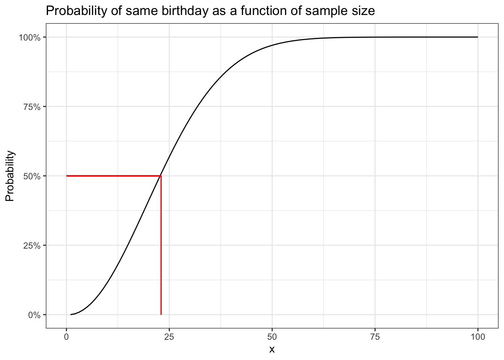

# Introduction {#intro}

### R packages required for this chapter


```r
library(knitr)
library(tidyverse)
```

## Preface

This is an intermediate epidemiology book that focuses on the methods most commonly encountered in problems arising in the domain of clinical epidemiology. The emphasis is on research design, quantitative analysis, critical thinking, and reproducible research methods. As it is my belief that epidemiologic principles are fundamental to high quality medical research and the learning and evaluation of these principles are best consolidated through direct application to problem solving, the text emphasizes the use of quantification, via open source software.

By the end of the book readers can expect to:   

::: {.blue-box}    
• Understand and critically evaluate basic study designs and statistical inferences in medical research    
• Understand, identify, and quantitatively evaluate sources of bias in epidemiologic and clinical studies     
• Master quantitative techniques for visualizing, cleaning, analyzing and interpreting epidemiologic and clinical data, including descriptive analyses, stratified analyses, regression analyses and meta-analyses.      

:::    

## Prerequisites {#pre}

There are multiple excellent introductory [@Gordis] [@Rothman], intermediate [@SN] and advanced [@RGL] epidemiology textbooks. There are no obligatory prerequisites for this book, although its use will be easier if there has been some prior exposure to basic epidemiologic concepts.

## My general philosophy for clinical epidemiology

The standard definition of epidemiology is the study of the distribution and determinants of health-related states or events in specified populations, and the application of this study to the control of health problems [@Last].

This definition may be expanded as follows:   

::: {.blue-box}     
* The distribution of health-related states refers to analysis by time, place, and population.     
* The different varieties of epidemiologic study include;     
  i) **Descriptive**: looking at patterns of disease within and between populations, trying to understand why disease rates go up and down, population variation     
  ii) **Etiologic**: understand the causes of disease, with implications for interventions to change disease distributions     
  iii) **Predictive**: predict outcomes for future patients, with implications for interventions to alter outcomes   
* The common determinants of of health-related states are biological, behavioral, social, cultural, economic, and political factors that influence health     
* The ultimate goal of epidemiology is the advancement of scientific knowledge to promote, protect, and restore health      

:::    

Clinical epidemiology may therefore be seen (?defined) as the application of epidemiologic principles and reasoning to improve clinical decision making and ultimately "patient" outcomes. However, I think it is preferable to interpret the term "patient" in the widest possible context, and consequently clinical epidemiology might range from the study of preventive measures in asymptomatic individuals to the evaluation of quaternary hospital interventions in large cohorts. As patient cohorts may arise not only from hospitals but also from specific neighborhoods, cities, provinces and countries the distinction between classic epidemiology and clinical epidemiology is hardly distinct. Consequently, while this book will focus on clinical applications, the underlying methods of classic epidemiology will also be presented, admittedly in a focused or condensed manner.

Epidemiology is the quantitative heart of both public health & clinical medicine (i.e. the science of counting within and across populations). This book will emphasize a hands-on quantitative approach to clinical epidemiology. Realizations that *"if you can't measure something, you can't improve it"* and *"intuition without quantification is often too imprecise to be useful"* support the importance of a rigorous quantitative approach. Epidemiology concepts may be vague, or plain hard to understand, and practical data manipulation provides opportunities to reinforce our understanding of these methods making us both better consumers and producers of medical research.

While this book stresses a quantitative approach, one must be careful to avoid the [McNamara](https://en.wikipedia.org/wiki/McNamara_fallacy) or the quantifiable fallacy "if you can't measure what is important, make what you can measure important", first documented during the Vietnam war, but similar erroneous uses of quantification may arise in clinical medicine. For example, progression-free survival (PFS) as a primary endpoint in many cancer trials largely because it is an endpoint which is easily measurable, but it meaningfulness compared to other metrics such as overall quality of life or overall survival is highly questionable.[@Prasad] Extensive quantification of biased results are also of no value. Consequently this book will also concentrate on recognizing common biases and assuring the application of methodologic rigor at all levels of study design, analysis, interpretation, and dissemination.

## Brief excursions into quantification

This is a brief excursions into quantification or why intuition is not good enough. Herein I offer several examples that hopefully highlight the need for careful quantification in order to reach reasonable conclusions.

**1. Birthday problem**

First, consider the birthday problem, a common parlor game, which shows how we may underestimate the play of chance. Imagine you are in a class of 60 people, what is the probability that at least 2 people share the same birthday?

---
output: html_document
---

::: {style="display: flex;"}
<div>

Potential answers


```
## A. < 5% 
## B. 5 - 15% 
## C. 15 - 25% 
## D. >99%
```

</div>

<div>


</div>
:::

Most people, who aren't already aware of the "trick" or "paradox" assume the probability is small given that a birthday may in occur on any one of 365 possible days. Given our natural tendency to egocentricity they imagine there are 59 chances of some else having the same birthday as them, or a probability of 59/365 or 16.2%. However this ignores the other 1711 (59*58) possible combinations between someone who is not you being compared to someone else who is also not you. Also as we will see, calculations involving exponentials are hardly intuitive to most people who tend to think in linearities.
As an easy solution, begin by considering the reverse problem what is the probability that no one has the same birthday as you. For the 2nd person, first next to you, probability of not being born on the same day as you = 364/365.
So the probability that 3rd person not on the same day as first 2 persons = 364/365* 363/365 and
The probability i th person not on the same day as 1st i-1 = 364/365 * 363/365 * 362/365 * (n-1)/365 or
$$ \prod_{i=0}^{i-1} (1- \dfrac{i}{365}) $$
Then the probability of being born on the same day = 1 - probability not being born on the same day. These calculations can be easily performed in `R`.


```r
# create a birthday function to calculate probability of 2 people in a group  (with a default group of 23)
# default of 23 since that gives probbaility = 50%
birthday <- function(n=23){
  1-prod(1-(0:(n-1))/365)
  }
birthday(60)
```

```
## [1] 0.9941
```

```r
# see why the default is 23 -> 50% probability
birthday()
```

```
## [1] 0.5073
```

```r
p <- numeric(100)
for(i in 1:100){
     p[i] <- birthday(i)
 }

p <- data.frame(x=seq(1,100, 1), p=p)
ggplot(p, aes(x,p)) +
  geom_line() +
  scale_y_continuous(labels = scales::percent_format()) +
  labs(y = "Probability") +
  ggtitle("Probability of same birthday as a function of sample size") +
  geom_segment(aes(x = 0, y = .50, xend = 23, yend = .50), color="red") +
  geom_segment(aes(x = 23, y = .50, xend = 23, yend = 0), color="red") +
  theme_bw()
```



So the probability of finding 2 people in a class of 60 with the same birthday is >99%. The graph also shows that provided there are more than 23 people in the class the probability will be > 50%. One can also appreciate the non-linearity of the relationship. To give an idea about the range of functions in `R` it should be noted that you don't have to write your own `birthday` function as above but can simple call the built in `pbirthday` function. One can also verify these calculations by doing simulations as demonstrated in this [blog](http://varianceexplained.org/r/birthday-problem/).


```r
# using the built in R function
cat("The probability of 2 people with the same bithday in a group of 23 is ", pbirthday(23), " and for a group of 60 is ",
pbirthday(60))
```

```
## The probability of 2 people with the same bithday in a group of 23 is  0.5073  and for a group of 60 is  0.9941
```

**2. Voter suppression**
Now being able to solve party games is a good, but not the only, reason to develop your quantitative skills. Consider the very current issue of voter suppression. A [news story](https://www.nbcnews.com/politics/elections/suppression-critics-charge-georgia-gop-gov-candidate-purging-voters-election-n918761) reported that in Georgia, where 32% of the population is black, the state has recently removed 670,000 voters of whom 70% were black. Is this difference likely due to the play of chance? In other words, how likely are we to observe 469,000 (.7 \* 670,000) blacks out of 670,000 if the selection probability is the same as the proportion of blacks in the general population (32%). This can be found with 1 line of code. Additional information about this function can be found with `help(binom.test`).


```r
binom.test(469000, 670000, .32)
```

```
## 
## 	Exact binomial test
## 
## data:  469000 and 670000
## number of successes = 469000, number of trials = 670000, p-value <2e-16
## alternative hypothesis: true probability of success is not equal to 0.32
## 95 percent confidence interval:
##  0.6989 0.7011
## sample estimates:
## probability of success 
##                    0.7
```

It appears highly unlikely to have excluded htis number of black voters if the null hypothesis is that voter suppression is independent of race.

**3. Avoiding disasters**

In 2018, medical researchers form John Hopkins reported a clinical trial in JAMA entitled ["Effect of a Program Combining Transitional Care and Long-term Self-management Support on Outcomes of Hospitalized Patients With Chronic Obstructive Pulmonary Disease A Randomized Clinical Trial"](https://jamanetwork-com.proxy3.library.mcgill.ca/journals/jama/fullarticle/2714645?resultClick=1) that concluded the intervention lead to "significantly **fewer** COPD related hospitalizations". The next year the authors published a retraction and a [new article](https://jamanetwork-com.proxy3.library.mcgill.ca/journals/jama/fullarticle/2752467) that concluded the intervention lead to "significantly **greater** COPD related hospitalizations".

The problem was a simple miscoding of the intervention and control arms. Being able to read and follow code, can assure that extra eyes are available to catch these errors which can happen to all of us. While reviewing their code to correct this major error, the research team discovered at least two other areas of erroneous code (in the commands to impute missing values and to aggregate data into summary variables).

On a broader level, sharing analytic code is increasingly the norm across many fields and provides an unambiguous record of the analytical methods used, aiding reproducibility, helping avoid duplicated effort and possibly accelerating innovation. It would be nice to see this become the norm in clinical epidemiology.

## Outline {#outline}

The scientific discipline of epidemiology has greatly expanded from its origin narrow focus on communicable disease epidemics to broadly include all phenomena related to population health. The aim of this book is assist in developing the design and analytical skills to critically evaluate (and produce) medical research that avoids biases and quantitative errors. The topics to be discussed will hopefully assist healthcare personnel in reaching the goal of being better consumers and producers of an ever expanding medical literature.

For a variety of reasons, not the least of which is my inexperience and lack of knowledge about publishing a html book, I have decided to make this book into two or three volumes. This will also allow me to release material more quickly and hopefully get feedback to correct the errors, incorporate suggestions, and generally improve the overall content.     

::: {.blue-box}

| Chapter          | Topic                                                    |
|------------------|----------------------------------------------------------|
| Chapter \@ref(intro) | Introduction to clinical epidemiology                    |
| Chapter \@ref(soft) | Introduction to statistical software - R                 |
| Chapter \@ref(vis) | Exploratory Data Analysis - Data visualization           |
| Chapter \@ref(meas) | Contingency tables, measures of association & R packages |
| Chapter \@ref(infer) | Statistical inference                                    |
| Chapter \@ref(design) | Non-experimental designs & incidence measures            |
| Chapter \@ref(references) | References                                               |

: Table of contents (volume 1)    

::: 


Future volumes are likely to include the following topics     


::: {.blue-box}      


- Causal inference     
- Confounding     
- Effect Measure Modification & interaction     
- Stratification & adjustment      
- Overview of biases (selection and information)    
- Quantitative bias analysis     
- Poisson regression    
- Survival analysis    
- Propensity Scores / Instrumental variables    
- Randomized clinical trials     
- Meta-analysis     
- Pharmacoepidemiology      
- Evidence based medicine / Guidelines      
- Health economics / ethics   

:::    

      
