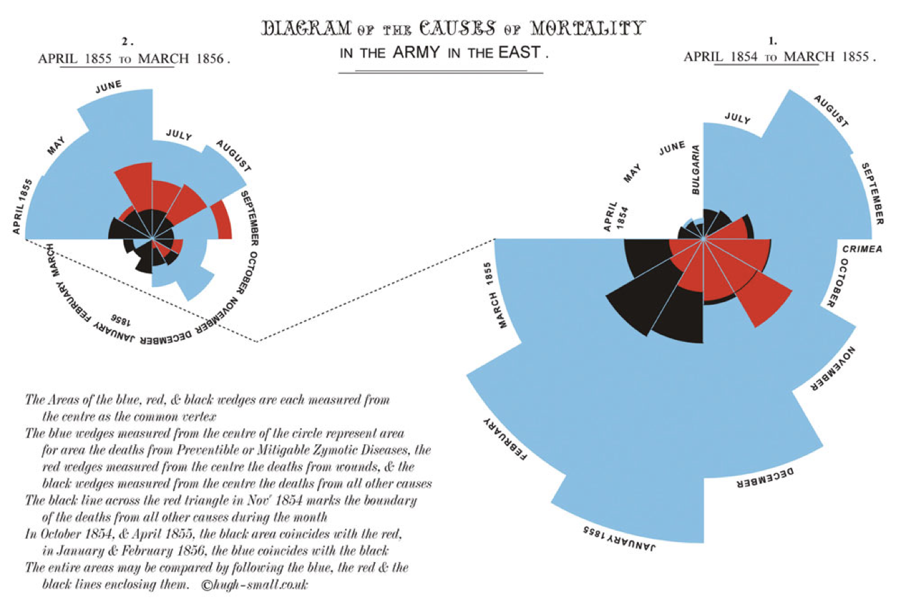
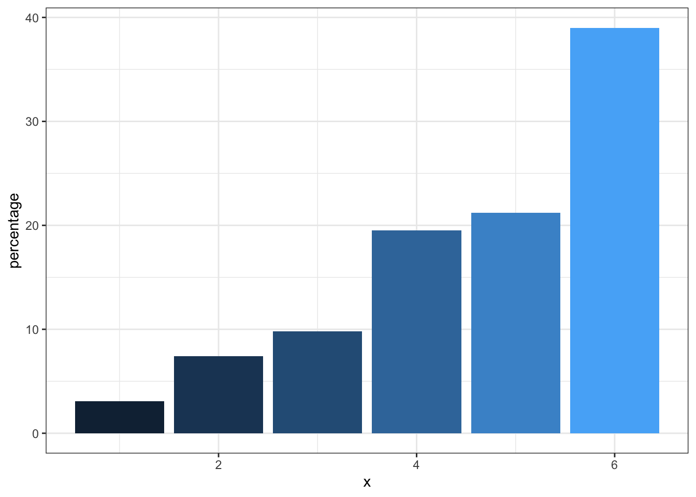
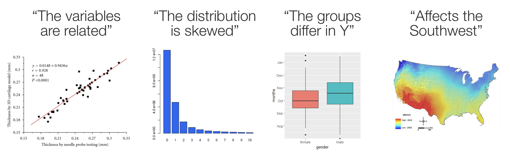
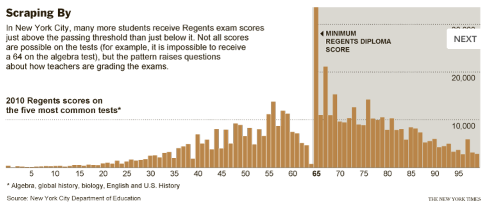

# Exploratory Data Analysis - Data visualization{#vis}

### R packages required for this chapter


```r
library(dslabs)
library(ggplot2)
library(dplyr)
library(magrittr)
library(gganimate)
library(scales)
library(transformr)
library(dslabs) # contains gapminder data set, also found in gapminder package
library(HistData)
library(maptools)
library(rgdal)
library(leaflet)
library(ggmap)
```

## Introduction
There is a modern tendency for researchers to immediately present their results in the most complex and sophisticated manner. This is often seen as proof of their respectability and importance. However, a step wise approach that begins by presenting data in its rawest form of Tables and Graphs is both more logical and beneficial to understanding. In fact, there is are several historical examples of excellent visualizations involving epidemiology.   

Although remembered as the mother of modern nursing, Florence Nightingale was an accomplished statistician too being the first female fellow of the Statistical Society of London (now Royal Statistical Society)[@econ]. She was particularly innovative in presenting data visually as by this example published in her 1858 monograph, “Notes on matters affecting the health, efficiency and hospital administration of the British army”. The chart displays the causes of the deaths of soldiers during the Crimean war, divided into three categories: “Preventible or Mitigable Zymotic Diseases” (infectious diseases, including cholera and dysentery, coloured in blue), “wounds” (red) and “all other causes” (black). As with today's pie charts, the area of each wedge is proportional to the figure it stands for, but it is the radius of each slice (the distance from the common centre to the outer edge) rather than the angle that is altered to achieve this. Her principal message—that even during periods of heavy fighting, such as November 1854, far more soldiers died from infection than from wounds—can be seen at a glance. It seems a fair bet that her talents as a data scientist contributed to her successful introduction of medical advances in military hospitals.


<div class="figure">

<p class="caption">(\#fig:unnamed-chunk-2)Classic epidemiology visualizations - Nightingale's Rose</p>
</div>
[Charles Minard’s](https://en.wikipedia.org/wiki/Charles_Joseph_Minard) 1869 publication of a flow map of Napoleon’s Russian 1812 campaign has been called best statistical graphic ever drawn by [Edward Tufte](https://en.wikipedia.org/wiki/Edward_Tufte) who is a preeminent 21st century statistician and pioneer in the field of data visualization. The figure shows 6 six types of data in two dimensions: the number of Napoleon's troops; the distance traveled; temperature; latitude and longitude; direction of travel; and location relative to specific dates. The chart tells with painful clarity the atrocious losses associated with this campaign as an initial force of 422,000 saw only only 10,000 return. On the retrurn trip 50% of the forces were lost while crossing the Bérézina river under heavy attack. “C'est la Bérézina” is a French expression used to describe a total disaster.


<div class="figure">

<p class="caption">(\#fig:unnamed-chunk-3)Classic epidemiology visualizations - Napoleon’s Russian 1812 Campaign </p>
</div>
## Why is data visualization important? 

Specifically, data visualizations can help      
* understand your data    
* understand basic concepts   
* emphasize a message    
* build trust with your audience    
* clarify your story for others    
* inform / influence their decisions    
* **poor data visualizations can do the opposite!**
    
    
As an example of an uninspired visualization, consider the frequently observed bar plot which is a regular item in scientific publications. Contrast the lack of information provided by the commonly used bar plot format (Figure \@ref(fig:bad)) (avoiding any association with inferiority simply because it was created with Excel) with the additional data insights provided by simple histograms and box plots (Figure \@ref(fig:better)).     


<div class="figure" style="text-align: center">

<p class="caption">(\#fig:bad)Poor presentation - Bar plot</p>
</div>


<div class="figure">

<p class="caption">(\#fig:better)Improved presentation - histograms and box plots</p>
</div>
   
As another example of an uninspired plot, consider the pie chart which has been rightly criticized as being difficult to understand as we are effectively being asked to compared angles and the area subtended by them rather than simply making linear comparisons as in barplots. Notwithstanding the presence of Steve Jobs with the pie chart, which visualization is easiest to understand?


---
output: html_document
---

:::: {style="display: flex;"}
::: {}

<div class="figure" style="text-align: left">

<p class="caption">(\#fig:unnamed-chunk-4)Pie chart (with Steve Jobs)</p>
</div>
:::

::: {}

<div class="figure" style="text-align: right">

<p class="caption">(\#fig:unnamed-chunk-5)Bar plot (without Steve Jobs)</p>
</div>
:::
::::

    
In contrast, if you have any doubts about the power of excellent visualizations, you **must** watch this [video](https://www.youtube.com/watch?v=Z8t4k0Q8e8Y) by [Hans Rosling](https://en.wikipedia.org/wiki/Hans_Rosling). Leaving aside his fabulous and infectious enthusiasm, (who wouldn't want to be a global health data scientist after watching this), the knowledge transfer from his data visualizations is simply amazing.   

## Creating an effective and professional appearing graph 

Here is a static image from Rosling's video. It certainly is of professional quality. Can we reproduce it?          

<div class="figure" style="text-align: center">

<p class="caption">(\#fig:unnamed-chunk-6)Gapminder data</p>
</div>

If the first plot we produce is of this quality, it will hopefully inspire us to realize what we can accomplish with data visualizations using `R`. While this may rightly not completely dispel the notion that a definitive learning curve is associated with`R`, it is certainly suggests it can be manageable. Here is the code that reproduces the graph.          


```r
dat <- gapminder %>% filter(year == 2007)
un_graph <- ggplot(dat, aes(x = gdp/population, y = life_expectancy)) +
    geom_point(aes(size = population, color = continent), alpha = 0.5) +
    stat_smooth(formula = y ~ log10(x), se = FALSE, size = 0.5, color = "black", method = 'gam', linetype="dotted") +
    xlab("GDP per capita") +
    ylab("Life expectancy at birth") +
    scale_size_area(guide = FALSE, max_size = 15) +
    scale_x_continuous(labels = scales::dollar, breaks = seq(0, 50000, by = 10000)) +
    ggtitle("Gapminder data from 2007") +
    labs(caption = "Data from dslabs library") +
    scale_color_brewer(name = "", palette = "Dark2") +
    theme_minimal(base_size = 12, base_family = "Georgia")

un_graph
```

```
## Warning: Removed 4 rows containing non-finite values (stat_smooth).
```

```
## Warning: Removed 4 rows containing missing values (geom_point).
```


```r
# to save your figure
# ggsave("files/un_graph.png")
```
    
    
The code can be understood as follows;    
1. We load the data which is available in both the `R` `Gapminder` and `dslabs` libraries (dslabs more complete).   
2. As data exists every 5 years from 1952, we have selectrd only 2007 data to match the static plot    
3. Graphing will use `ggplot` function from the `ggplot2` library    
4. The `ggplot` function first requires a data argument (in the form of a data frame)    
5. The next argument is `aes` for aesthetics and identifies the x and y variable names from the data frame    
6. In R any task such as identifying variable names can usually be accomplished by several ways (e.g. `names(gapminder)`, `str(gapminder)`, `glimpse(gapminder)`, `head(gapminder)`)    
7. Output is layered onto the graphical surface beginning here with the data points (`geom_points`) with color assigned according to `continent`, followed by a smoothed regression line (`stat_smooth`)      
8. Next purely aesthetic details such as a title, legends and a theme are added. As a beginner, and even as a more advanced user, it is not necessary to memorize all the possible formatting options as quick and accessible online resources are available to add these final refinements to your graphs (see [](https://ggplot2.tidyverse.org)
    
    
Using the `gganimate` package, a fully animated graph can be made with the code below 
<!-- -->


```r
### animated graph
un_plot <- ggplot(gapminder, aes(x = gdpPercap, y = lifeExp)) +
    geom_point(aes(size = pop, color = continent), alpha = 0.5) +
    stat_smooth(formula = y ~ log10(x), se = FALSE, size = 0.5, color = "black", method = 'gam', linetype="dotted") +
    xlab("GDP per capita") +
    ylab("Life expectancy at birth") +
    scale_size_area(guide = FALSE, max_size = 15) +
    scale_x_continuous(labels = scales::dollar) +
    ggtitle("Gapminder data from 2007") +
    labs(caption = "Data from gapminder library") +
    scale_color_brewer(name = "", palette = "Dark2") +
    theme_minimal(base_size = 12, base_family = "Georgia") +
    # gganimate code
    ggtitle("{frame_time}") +
    transition_time(year) +
    ease_aes("linear") +
    enter_fade() +
    exit_fade()

animate(un_plot)
```

While we are considering this international data source, let's see how you do with a simple quiz.   
Q1. Which countries in each pair have the highest child mortality (2015)?   
Q2. Which pairs of countries are most similar?    
* Sri Lanka or Turkey    
* Poland or South Korea    
* Malaysia or Russia    
* Pakistan or Vietnam     
* Thailand or South Africa     

Now as it is unlikely that you have actual knowledge of country specific mortality data, most individuals will attempt to employ some heuristic to help answer the question. One such heuristic would say *"European countries lower child mortality than non-European"*. Following that heuristic, our answers might be: Sri Lanka, South Korea, Malaysia with Pakistan or Vietnam and Thailand or South Africa as non-European countries being the most similar. Fortunately we can do better by analyzing the `gapminder` dataset


```r
## A bit of code
library(dslabs) #source of gapminder data
data(gapminder)

# write a simple function for the comparison between 2 countries
compare_2 <- function(x,y){
    gapminder %>% filter(year == "2015" & country %in% c(x, y)) %>%
    select(country, infant_mortality)
}

compare_2("Sri Lanka", "Turkey")
```

```
##     country infant_mortality
## 1 Sri Lanka              8.4
## 2    Turkey             11.6
```

```r
compare_2("Poland", "South Korea")
```

```
##       country infant_mortality
## 1 South Korea              2.9
## 2      Poland              4.5
```

```r
compare_2("Malaysia", "Russia")
```

```
##    country infant_mortality
## 1 Malaysia              6.0
## 2   Russia              8.2
```

```r
compare_2("Pakistan", "Vietnam")
```

```
##    country infant_mortality
## 1 Pakistan             65.8
## 2  Vietnam             17.3
```

```r
compare_2("Thailand", "South Africa")
```

```
##        country infant_mortality
## 1 South Africa             33.6
## 2     Thailand             10.5
```

If we were merely ignorant we might have expected to get 2.5 answers right but it seems if we followed our heuristic we would have got 0 right answers implying we are more than simply ignorant but actually misinformed! We can use the same dataset to query our heuristic about better survival in European countries.  


```r
gapminder %>% filter(continent == "Asia" | continent == "Europe") %>% 
    filter(year %in% c(1962, 1980, 1990, 2012)) %>% 
    ggplot(aes(fertility, infant_mortality, color= continent)) + 
    facet_grid(cols = vars(year)) +
    geom_point() + 
    ylim(0,200) +
    ggtitle("Infant mortality over time") +
    theme_bw()
```

```
## Warning: Removed 53 rows containing missing values (geom_point).
```


```r
gapminder %>% filter(continent == "Asia" | continent == "Europe") %>% 
    filter(year %in% c(1962, 1980, 1990, 2012)) %>% 
    ggplot(aes(fertility, life_expectancy, color= continent)) + 
    facet_grid(cols = vars(year)) +
    geom_point() + 
    ggtitle("Life expectancy over time") +
    theme_bw()
```


   
These graphs show that the heuristic of improved infant and overall life expectancy among European countries was true 60 years ago but is no longer today's truth. This underlines the need to continually question our baseline assumptions.


## Graphical choices

Visualizations play an important role in understanding the data, exploring the data, and interpreting the data.   
The most common visualization methods are:   
* Histograms    
* Scatterplots    
* Boxplots    
* Survival curves (Kaplan Meier)    
* Heatmaps and many more   


A graph can provide a quick interpretation of the data and orient more in depth analyses.     

<div class="figure" style="text-align: center">

<p class="caption">(\#fig:unnamed-chunk-12)Data visualization -> Quick understanding of data</p>
</div>


Consider this story from the [New York Times](https://www.nytimes.com/2011/02/19/nyregion/19schools.html?searchResultPosition=1) about the scoring of high school leaving exams where 65 is the passing grade. A histogram of the grades shows important abnormalities with 5 times more students scoring exactly 65 than those scoring between 61-64, leaving a suspicion that grading may not be completely unbiased. Simply reporting the mean, median, standard deviations, percentage passing or any other numerical summary would not have detected the strangeness of the data.     


<div class="figure" style="text-align: center">

<p class="caption">(\#fig:unnamed-chunk-13)Histogram of grades</p>
</div>

Graphs can also be combined to provide further insights into the data. The following is a graph from the excellent book [The Art of Statistics](https://github.com/dspiegel29/ArtofStatistics) by David Speigelhalter that shows the gender and timing of the 215 confirmed victims of the mass murderer, Dr. Harold Shipman.   


<div class="figure" style="text-align: center">

<p class="caption">(\#fig:unnamed-chunk-14)Murder victims</p>
</div>

Here a basic scatter plot has been combined with marginal histograms. This enables a quick appreciation that the victims were     
1. more often women     
2. mostly older but some younger victims in more recent times   
3. a gap occured around 1992    
4. there were increased murders in later years      


Fortunately, most datasets that we will examine are not this gruesome. 

## Example - A modern version of the "Ghost Map"

Dr. John Snow (1813-1858) was a famous British physician and is widely recognized as a legendary figure in the history of public health and a leading pioneer in the development of anesthesia. As a leading advocate of both anesthesia and hygienic practices in medicine, he not only experimented with ether and chloroform but also designed a mask and method how to administer it. He personally administered chloroform to Queen Victoria during the births of her eighth and ninth children, in 1853 and 1857, which assured a growing public acceptance of the use of anesthetics during childbirth. In the realm of public health, Snow is especially known for his work on the transmission of cholera during the cholera epidemics that occurred regularly in 19th century London, generally believed to be brought in by merchant marine trade, exacerbated by overcrowding (London 1850 population exceeded 2 million) and unsanitary streets.     

An excellent book covering Snow’s actions in identifying the source of the 1854 Soho cholera outbreak is masterfully told in [The Ghost Map](https://www.amazon.ca/Ghost-Map-Londons-Terrifying-Epidemic/dp/1594482691?language=en_CA) by Steven Johnson. The book illustrates the importance of “shoe leather” epidemiology in establishing the water transmission theory of cholera and the difficulties in overcoming the [confirmation bias](https://en.wikipedia.org/wiki/Confirmation_bias) supporting the prevalent miasma theory of transmission. Final recognition of the correctness of Snow’s theory was hard earned as his initial research on cholera had been criticized in medical reviews, including the Lancet. A philistine might say this is but an early example of an ongoing problem with peer review publishing in august medical journals (more on modern contemporary examples will be forthcoming in later chapters).      

John Snow is now recognized as one of the founders of modern epidemiology and in later publications Snow made use of data visualization to strengthen his message. Snow’s original geographical mapping of the data is not available but one that he drew about a year later in 1855 depicts the deaths and is referred to as The Ghost Map. More details on the history of the 1854 Broad Street cholera outbreak are found [here](https://en.wikipedia.org/wiki/1854_Broad_Street_cholera_outbreak).

Here is an initial plot as displayed on John Snow’s original map.    

<div class="figure">

<p class="caption">(\#fig:unnamed-chunk-15)Classic epidemiology visualizations - John Snow's Cholera Broad Street Ghost Map</p>
</div>
     
When many points are associated with a single street address, they are “stacked” in a line away from the street so that they are more easily visualized. This dataset is found in the `HistData` package and has 578 observations on the following 3 variables, giving the address of a person who died from cholera.    

### Using modern Geographic Information System mapping

Can download a zip file with GIS layers relating to John Snow's 1854 investigation of the Cholera outbreak in London. This file contains a number of GIS layers created from Snow's original map which allow analyses to be conducted on the data in modern GIS systems.    


```r
## Download the zip archive of geographical information
download.file(url      = "http://www.rtwilson.com/downloads/SnowGIS_v2.zip",
              destfile = "datasets/SnowGIS_v2.zip")

## Unzip
unzip(zipfile = "datasets/SnowGIS_v2.zip", exdir ="datasets")
## List files in the unzipped folder -> dir(path = "./datasets/SnowGIS") 

# register_google(key = "Put your API key here") # my API is hidden
GDAL <- GDALinfo("./datasets/SnowGIS/OSMap.tif")
OSMap <- readGDAL("./datasets/SnowGIS/OSMap_Grayscale.tif")
par(mar = c(0,0,0,0))

# image(OSMap, col = grey(1:500/1000)) modern plot not shown here

getinfo.shape("./datasets/SnowGIS/Cholera_Deaths.shp")
map1 <- get_map(c(-.137,51.513), zoom=16)
london_main <- ggmap(map1) +
    ggtitle("Modern Google style Ghost map") 
```


```r
### Assigning the Cordinates of Deaths & Pumps Variables from the Dataset
deaths <- readShapePoints("datasets/SnowGIS/Cholera_Deaths")
```

```
## Warning: readShapePoints is deprecated; use rgdal::readOGR or sf::st_read
```

```r
pumps <- readShapePoints("datasets/SnowGIS/Pumps")
```

```
## Warning: readShapePoints is deprecated; use rgdal::readOGR or sf::st_read
```

```r
df_deaths <- data.frame(deaths@coords)
df_pumps <- data.frame(pumps@coords)

tmp <- rbind(df_deaths, df_pumps)
tmp$type <- c(rep('death', times=dim(df_deaths)[1]),
rep('pump', times=dim(df_pumps)[1]))

coordinates(df_deaths)=~coords.x1+coords.x2
proj4string(df_deaths)=CRS("+init=epsg:27700") 
```

```
## Warning in showSRID(uprojargs, format = "PROJ", multiline = "NO", prefer_proj =
## prefer_proj): Discarded datum OSGB_1936 in Proj4 definition
```

```r
df_deaths = spTransform(df_deaths,CRS("+proj=longlat +datum=WGS84"))
df=data.frame(df_deaths@coords)
lng=df$coords.x1
lat=df$coords.x2

coordinates(tmp)=~coords.x1+coords.x2
proj4string(tmp)=CRS("+init=epsg:27700")
```

```
## Warning in showSRID(uprojargs, format = "PROJ", multiline = "NO", prefer_proj =
## prefer_proj): Discarded datum OSGB_1936 in Proj4 definition
```

```r
tmp = spTransform(tmp, CRS("+proj=longlat +datum=WGS84"))
tmp <- data.frame(tmp@coords, type=tmp@data$type)

library(patchwork)
snow.plot1 <- london_main + geom_point(mapping=aes(x=coords.x1, y=coords.x2, col=type, size = 1), data=tmp) +
    annotate("text", x = -.1361, y = 51.513, label = "X\n Broad Street pump", colour="black",  size = 4) +
    labs(subtitle = "Regular plot")
snow.plot1
```


```r
snow.plot2 <- london_main + geom_density2d(data = tmp[tmp$type =="death", ], aes(x = coords.x1, y = coords.x2),
    size = 0.6) +
    annotate("text", x = -.1361, y = 51.513, label = "X\n Broad Street pump", colour="black",  size = 4) +
    labs(subtitle = "Density plot")
snow.plot2
```


