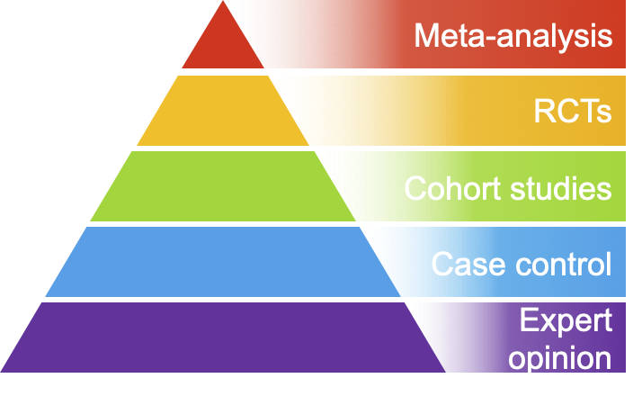
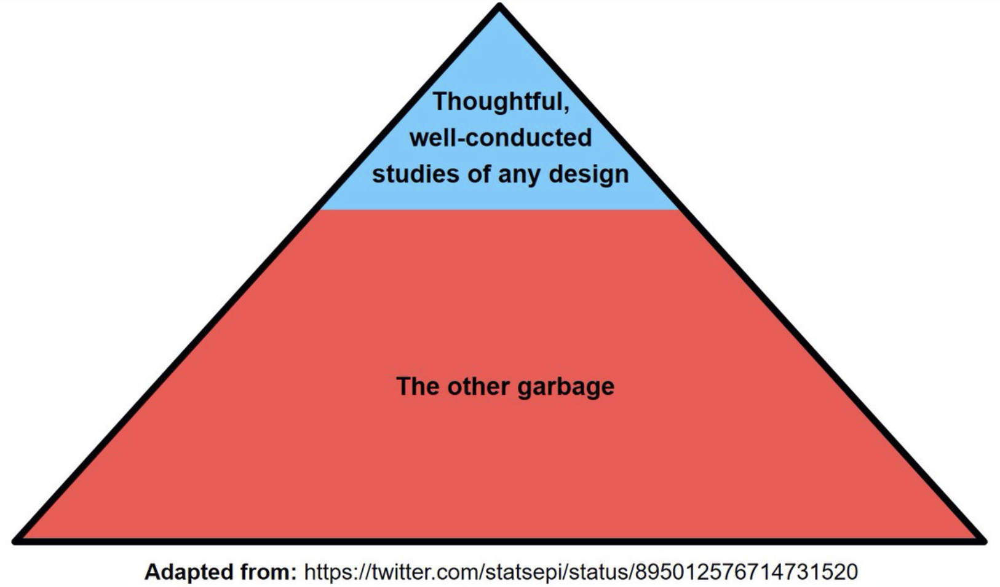
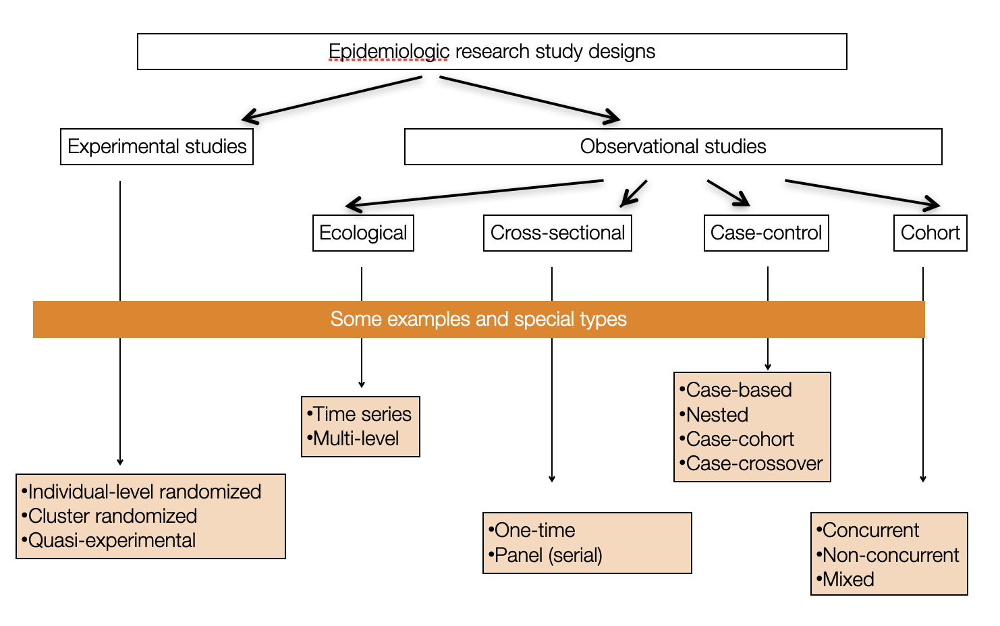
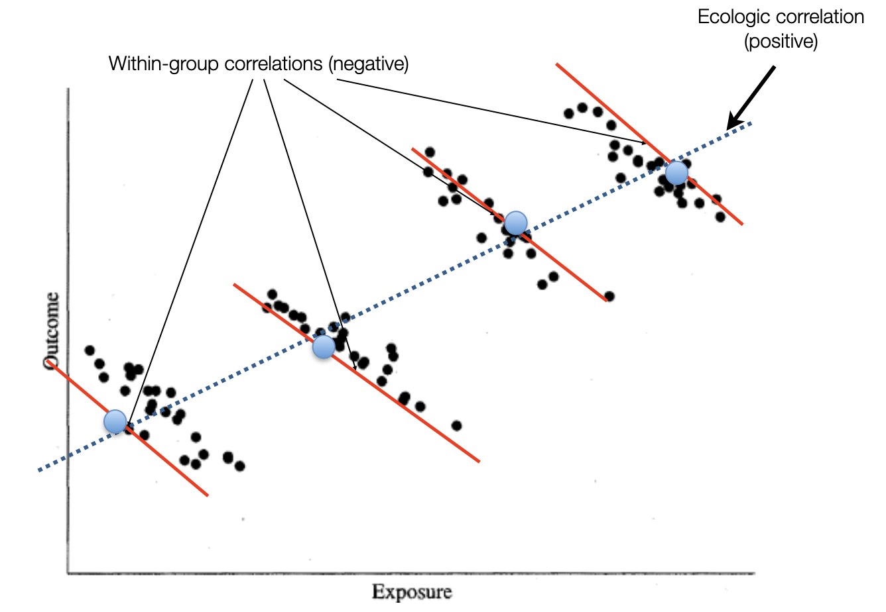
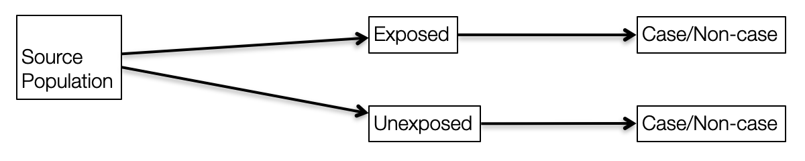
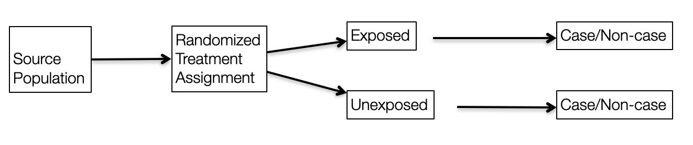
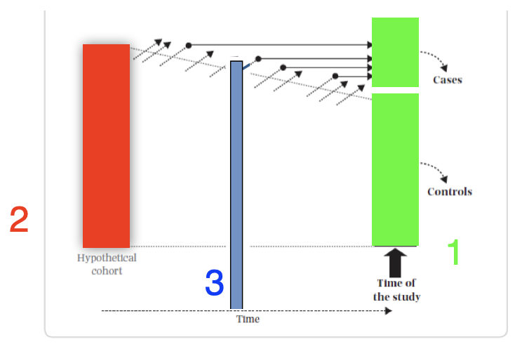
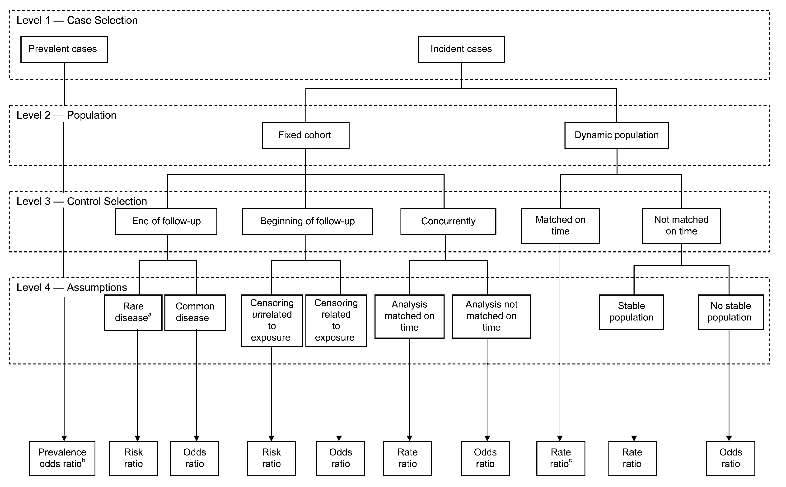

# Non-experimental designs {#design}

### R packages required for this chapter


```r
library(knitr)
library(epiR)
```


## Introduction

This chapter will provide only the briefest review of non-experimental study designs so as to try and assure that the reader has a common baseline knowledge of the advantages and limitations of each design. The excellent introductory [@Gordis] [@Rothman], intermediate [@SN] and advanced [@RGL] epidemiology textbooks referred to in Chapter \@ref(pre) provide more complete information.\
The common hierarchy of evidence based medicine (EBM) research designs is presented in this ubiquituous pyramid schema.

<div class="figure" style="text-align: center">

<p class="caption">(\#fig:pyramid)EBM pyramid of research designs</p>
</div>

However, Figure \@ref(fig:pyramid) is another example of a simple heuristic which enables quick but often erroneous conclusions concerning study design. Unfortunately as shown in this and susequent chapters, there are no shortcuts to the evaluation of study designs which need individual considerations. In that respect the following [pyramid](https://twitter.com/statsepi/status/895012576714731520?lang=en) is both more realistic and helpful.

<div class="figure" style="text-align: center">

<p class="caption">(\#fig:unnamed-chunk-3)EBM pyramid of research designs</p>
</div>

Although one may debate that the magnitude of the blue area is an overestimate of the scale of good designs, it does underline the importance in clinical epidemiology of assessing individual study quality for both experimental and non-experimental studies. As this book is orientated toward clinical epidemiology, experimental designs (randomized clinical trials (RCTs)) will be emphasized and discussed separately in a later chapter. RCTs have a special emphasis since they are often considered the pinnacle of research designs and greatly influence medical guidelines and consequently clinical practice.

The following is a taxonomy of the different types of study designs.

<div class="figure" style="text-align: center">

<p class="caption">(\#fig:unnamed-chunk-4)Overview of different research designs</p>
</div>

Ecological study designs involve populations or groups of individuals as the unit of analysis as opposed to the other observation designs where the unit of analysis is the individual. Ecological studies are especially useful for descriptive reports, the analysis of birth cohorts, when exposure is only available at the group level, or to investigate differences between populations when the between population difference is much greater than within population differences. For example, ecological studies would be appropriate for aggregate exposure involving air pollution, health care systems, or gun control laws. One must be careful to avoid the [**ecological bias**](https://en.wikipedia.org/wiki/Ecological_fallacy) that can occur because an association observed between variables on the aggregate level does not necessarily represent the association that exists at the individual level. The ecological bias can be shown graphically in Figure \@ref(fig:ecology) where the discordance of the exposure association between groups and individuals is especially strong.

<div class="figure" style="text-align: center">

<p class="caption">(\#fig:ecology)Ecological bias</p>
</div>

The real problem is **cross-level reference**. For an ecological study the level of measurement, level of analysis, and level of inference must all remain at the group level. Ecological studies will not be considered further in this book.

Among non-experimental designs involving individuals, there are essentially 3 different ways at arriving at conclusions by\
1) reference to population follow-up (cohort)\
2) joint assessment of exposure among cases and non-cases (case-control)\
3) reference to one particular time (cross-sectional)

Since all study designs, including the non-experimental (cohort, case-control, cross-sectional) either secretly or not, aim to estimate similar causal quantities, it could be argued that emphasizing their distinctions is somewhat artificial. In other words, do not mistake the journey (particular study type) for the destination (causal effect of an exposure).

This lack of randomization with observational studies, is why we are continually reminded that non-experimental studies can't provide evidence for causality. Instead we are told to talk of associations. A list of the top 2019 JAMA Internal Medicine articles as determined by [Altmetric scores](https://www.altmetric.com) can be found [here](https://jamanetwork.com/pages/2019-most-discussed-articles) and is reproduced in Figure \@ref(fig:jama).

<div class="figure" style="text-align: center">

<p class="caption">(\#fig:jama)JAMA Internal Medicine Top 2019 Altmetric Articles</p>
</div>

Most interestingly, 11 of the top 14 articles have "association" in their title. But are we really interested in mere associations of the type that matches in your pocket or yellow fingers are associated with lung cancer? I don't believe so and suspect most people are more interested for obvious reasons in causality and whether they care to admit it or not are subconsciously interpreting association studies in this light[@cword] . Otherwise there appears little justification to waste one's time on reading these articles.

Although this is not a book on causality and although I most definitely lack the expertise to delve deeply into this issue, I do think we should acknowledge that the heuristic that observational studies can never inform on causality is flawed and should think more deeply about how we can reach this elusive goal of establishing causality. Please see the following excellent references on causal inference, [@Westreich], [@pearl_intro], [@Hernan_book] and [@Pearl_causality], ordered in increasing detail and complexity.


::: {.blue-box}
+----------------------------------------------------------------------------------------------------------------------------------------------------------------------------------+
| Key concepts for causal inference                                                                                                                        |
+==================================================================================================================================================================================+
| -   Temporality (exposure must occur before the outcome)                                                       |
|                                                                                                                                                                                  |
| -   Conditional exchangeability (to minimize confounding and selection bias to achieve comparability using regression, stratification, restriction, or standardization)                                             |
|                                                                                                                                                                                  |
| -   Positivity and consistency (to assure the existence of a potential counterfactual) |
|                                                                                                                                                                                  |
| -   No measurement error (to minimize misclassification in exposure, outcome or confounders required to achieve conditional exchangeability)                                                                                            |
+----------------------------------------------------------------------------------------------------------------------------------------------------------------------------------+
:::     


Again more details may be found in the above mentioned references.

## Cohort studies

A cohort is a designated/defined group of individuals followed through time often to study incidence of disease in the study group. Examples of sample cohorts may include occupational cohorts, specific groups at risk of a disease or convenience samples (e.g. Nurses or Framingham cohorts). Be careful to distinguish between study, source and target populations.

Cohort studies offer multiple potential advantages:\
\* Can study exposures that are difficult or unthinkable to randomize\
\* Study population often more representative of target pop'l\
\* Allows calculation of incidence rates\
\* Time sequence is generally clear (exposure before outcome)\
\* Efficient as multiple outcomes / exposures can be assessed as new hypothesis are developed over time

Cohort studies can be of 2 formats;\
1. Concurrent (prospective) cohort studies: assembled at present time. Advantages: measurement of exposure, outcome, covariates is decided at baseline and can see temporal ordering of exposure and disease. Disadvantages: expensive and time consuming.\
2. Historical/non-concurrent/mixed (retrospective) cohort studies: incorporates historical time exposed (at least partially). Advantages: less expensive; linking data registries (e.g. exposure and outcome information). Disadvantages: can only use available information; possibly lower quality measurements; data may not have been collected for research purposes.

In cohort studies, exposed/unexposed groups **exist** in the source population and are **selected** by the investigator while in an RCT, a form of closed cohort, treatment/exposure is **assigned** by the investigator.

<div class="figure" style="text-align: center">

<p class="caption">(\#fig:unnamed-chunk-5-1)Observational research design</p>
</div><div class="figure" style="text-align: center">

<p class="caption">(\#fig:unnamed-chunk-5-2)Experimental research design</p>
</div>

Practically, the best general approach to achieve valid causal non-experimental designs is to try to emulate the RCT[@emulate] you would like to do with special attention to the following:\
\* Selection of population\
\* Exposure definition (induction, duration, intensity, cumulative exposures)\
\* Outcome ascertainment with minimization of lost to follow-up

## Case control

Sometimes it useful to start with the cases! Although important for all research designs, it is obviously essential for case control designs to have an unambiguous, valid case definition preferably using objective and established criteria that avoids any misclassification or other biases. Careful distinction between incident and prevalent cases is also of prime importance. Where the cases are found is a function of the particular research question and setting. Potential sources include hospital registers, vital records (births/deaths), national registries (e.g., for cancer, diabetes) and community clinics.

After case identification, the most important and difficult next step is the selection of the controls. Consideration of a counterfactual model can help operationalize the choice of controls. Controls are drawn from a sample of individuals without the disease, selected from the same reference population that originated the cases and who go through the same selection processes as the cases. Moreover, controls must be individuals who, if they had developed the case disease, would have been included in the case group.

Case control studies may be conducted with an open or closed study population. In a dynamic (open) population, there are two options for selecting controls; i) if the population is in a steady-state, sample randomly from the person-time distribution ii) if not, controls may be selected at the same time as cases occur (i.e., "matched on time"). In a closed study population, there are three options for selecting controls; i) at the end of follow-up ii) at the beginning of follow-up iii) throughout follow-up as cases occur ("matched on time"). Analytically, these distinctions lead to different effect measures, each of which (under various assumptions) parallels an equivalent measure from a full-cohort study.

<div class="figure" style="text-align: center">

<p class="caption">(\#fig:unnamed-chunk-6)Case control sampling times</p>
</div>

-   Sample point 1 - This is the classic "**case based**" sampling (AKA "exclusive", "cumulative") that occurs at the end of follow-up. In this case, the incident odds ratio (OR) ≈ risk ratio (RR) (under the rare disease assumption)\
-   Sample point 2 - This is "**case-cohort**" sampling (AKA "inclusive") that occurs at the beginning of follow-up. In this case, the incident odds ratio (OR) ≈ risk ratio (RR) (rare disease assumption not required)\
-   Sample point 3 - "**Nested**" sampling (AKA "incidence density") from the distribution of exposed person-time matched during follow-up. In this case, the incident odds ratio (OR) ≈ rate ratio (RR)

The efficiency of the case control design comes from taking a sample, and not all, of the controls. Under that logic, it may be reasonably asked why not take only a sample of the cases? Consider the following example.


```r
set.seed(1234)

dat <- matrix(c(200,100,1800,1900), nrow=2, dimnames = list(c("Not exposed","Exposed"), c("MI yes", "MI no")))

kable(dat, caption = "Full cohort")
```


Table: (\#tab:unnamed-chunk-7)Full cohort

|            | MI yes| MI no|
|:-----------|------:|-----:|
|Not exposed |    200|  1800|
|Exposed     |    100|  1900|

```r
full <- epi.2by2(dat)

dat.con10 <- dat
dat.con10[,2] <- dat[,2]/10
kable(dat.con10, caption = "Case control - 10% of controls")
```


Table: (\#tab:unnamed-chunk-7)Case control - 10% of controls

|            | MI yes| MI no|
|:-----------|------:|-----:|
|Not exposed |    200|   180|
|Exposed     |    100|   190|

```r
full.10 <- epi.2by2(as.matrix(dat.con10))

dat.case10 <- dat
dat.case10[,1] <- dat[,1]/10
dat.case10[,2] <- dat[,2]/10
kable(dat.case10, caption = "Case control - 10% of cases and controls")
```


Table: (\#tab:unnamed-chunk-7)Case control - 10% of cases and controls

|            | MI yes| MI no|
|:-----------|------:|-----:|
|Not exposed |     20|   180|
|Exposed     |     10|   190|

```r
full.case10 <- epi.2by2(as.matrix(dat.case10))
```

The OR is 2.11 with 95% CI 1.65 - 2.71. The OR is fairly close to incident risk ratio for the full cohort (RR = 2) since the rare assumption is approximately true, about 10% incidence.\
If we select only 1/10 of the controls the OR is 2.11 with 95% CI 1.54 - 2.89, a trivial difference.\
On the other hand, suppose we take a 1/10 sample of the cases, the OR remains unbiased at 2.11 but the 95% CI 0.96 - 4.63 is much larger. It is this lack of precision that mandates the inclusion of all cases in a case / control design.\
This is easily understood when it is recalled that the standard error of the estimated OR is $$se(\hat{OR}) = \sqrt{\dfrac{1}{a} + \dfrac{1}{b} + \dfrac{1}{c} + \dfrac{1}{d}}$$ so the largest component comes from the smallest cell entries and se will be minimized by taking all the cases.

The following figure from [@Knol] is a useful summary of the effect measures available from case control studies depending on the nature of the cases (prevalent or incident; level 1), the type of source population (fixed cohort or dynamic population; level 2), the sampling design used to select controls (level 3), and the underlying assumptions (level 4).

<div class="figure" style="text-align: center">

<p class="caption">(\#fig:unnamed-chunk-8)Effect measures from case control designs</p>
</div>

In summary, case control studies have the advantages of being faster to perform and less expensive to conduct than cohort studies but care must be exercised that they, like all study designs, are carefully performed. Proper control selection is essential and must come from the same target population as cases (easiest when performed within an established cohort). Controls must be sampled independently of exposure and there is improved precision with more controls (1,2,3,4) but diminishing returns (SE 0.167, 0.145, 0.138, 0.134). Effect measure precision is improved precision by taking all the cases. Although case control studies are susceptible to recognized biases (Berkson, recall, incidence/prevalence) these can be avoided with necessary care. The routine placement of case-control studies under cohort studies on hierarchies of study designs is not well-founded.

An interesting variant is the case crossover design where each case serves as its own control thereby minimizes confounding for time invariant factors whether observed or unobserved. Exposures must vary over time but have a short induction time, a transient effect (e.g., triggers for heart attacks, asthma episodes) and no cumulative effects. This design is the observational analogue of the crossover randomized trial.

A final variant are case series without any controls. While the early identification of cases may prove sentinel for a new disease (see cases series that lead to first identification of the [AIDS epidemic](https://www.cdc.gov/mmwr/preview/mmwrhtml/june_5.htm)), the inferential strength of this design is limited due to the lack of any suitable comparator. Moreover arbitrary selection of cases and an embellished narrative can lead to an undervaluing of scientific evidence and great public health danger (see cases series [@Wakefield], later retracted, at the genesis of the vaccine autism falsehood).

## Cross sectional

Cross sectional studies are most useful for descriptive epidemiology with a primary goal of estimating disease prevalence. As no follow-up is required, cross sectional studies are fast, efficient and can enroll large numbers of participants. However they have little value for causal inference as they provide no information on timing of outcome relative to exposure (temporality) and include only those individuals alive at the time of the study, thereby introducing a prevalence-incidence bias. Due to these limitations, this study design has little value in clinical epidemiology and will not be discussed further.

## Miscellaneous designs

There are, of course, many variants and other miscellaneous non-experimental designs including [difference-in-difference (DID)](https://en.wikipedia.org/wiki/Difference_in_differences), [regression discontinuity](https://en.wikipedia.org/wiki/Regression_discontinuity_design), and [quasi-experimental](https://en.wikipedia.org/wiki/Quasi-experiment) to name but a few.

Conceptually, DID design can be best thought of as a combination of a before & after comparison and a comparison between treated & untreated individuals and are therefore also known as ontrolled before and after studies. These studies minimize bias due to pretreatment differences in outcomes,allow for a flexible control of time invariant confounders and are preferable to an uncontrolled before and after comparison of only treated individuals.

Quasi-experimental designs refer to approaches to effect estimation in which investigators identify (or create) a source of variation in the exposure which is unrelated to the rest of the causal system under study---including the outcome (except through the exposure itself) and the confounders. A classic historical example is John Snow's cholera work where which household received "dirtier" water from the Southwark and Vauxhall company or "cleaner" water from the Lambeth company was a quasi-random event. The company can thus be seen as an instrumental variable, similar to randomization. Regression discontinuity designs are a special subset of quasi-experimental designs where subjects just above and below a given threshold are essentially identical on all observed and unobserved characteristics yet are arbitrarily assigned different therapies.
